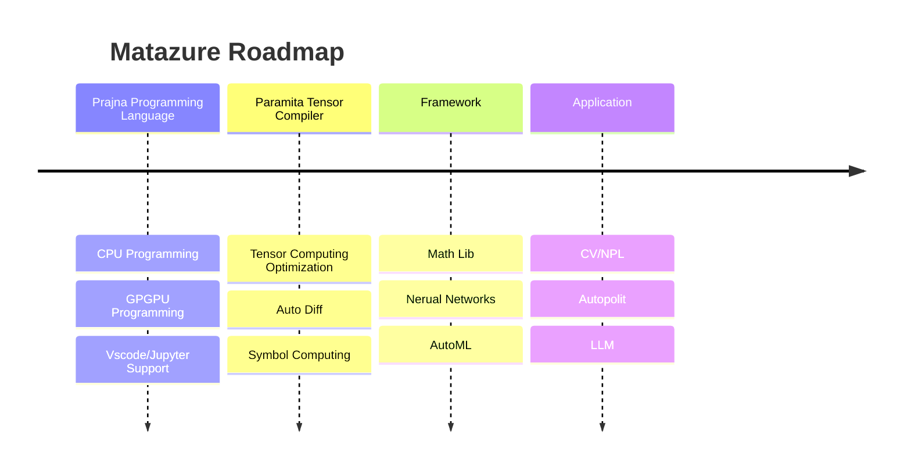

# Matauzre

The Matazure is an organization focused on computating.
We make it more effective to use computing resource.
The following is our roadmap.

```mermaid
timeline
    title Matazure Roadmap
    Prajna Programming Language: CPU Programming: GPGPU Programming: Vscode/Jupyter Support
    Paramita Tensor Compiler: Tensor Computing Optimization : Auto Diff: Symbol Computing
    Framework: Math Lib: Nerual Networks: AutoML
    Application: CV/NPL: Autopolit: LLM
```
